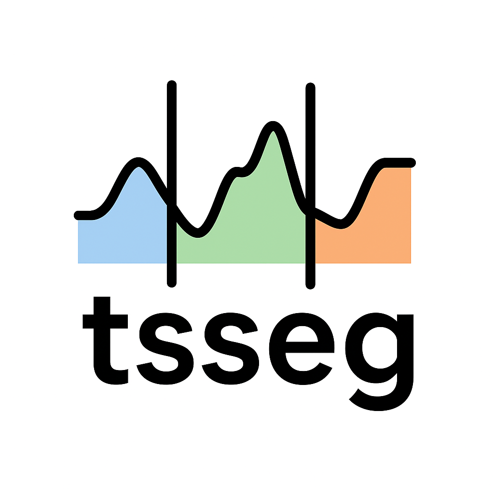

# tsseg - Time Series Segmentation

<p align="center">
  
</p>

<p align="center">
  <a href="https://www.python.org/"></a>
  <a href="https://github.com/fchavelli/tsseg/releases/tag/v0.1.0"></a>
  <a href="https://github.com/astral-sh/ruff"></a>
  <a href="https://github.com/fchavelli/tsseg/blob/main/LICENSE"></a>
</p>

**tsseg** is a Python library for **Time Series Segmentation**, covering both Change Point Detection and State Detection. It bundles 30+ segmentation algorithms, evaluation metrics, data loaders, and real-world benchmark datasets under a unified API.

## Quick Start

```python
from tsseg.data.datasets import load_mocap
from tsseg.algorithms import ClapDetector
from tsseg.metrics import StateMatchingScore

# Load a time series
X, y_true = load_mocap(trial=0)

# Segment
segmenter = ClapDetector()
segmenter.fit(X, axis=0)
y_pred = segmenter.predict(X)

# Evaluate
score = StateMatchingScore().compute(y_true, y_pred)
print(f"SMS: {score['score']:.4f}")
```

📖 Documentation: build locally with `make docs` (see below).

## Installation

> **Requires:** `conda` in your PATH (or set it in a `.env` file — see `.env.example`).

```bash
git clone https://github.com/fchavelli/tsseg.git
cd tsseg
make install          # creates the conda env + installs tsseg
conda activate tsseg-env
```

<details>
<summary><strong>Manual installation</strong></summary>

```bash
conda env create -f environment.yml
conda activate tsseg-env
pip install -e .[all]
python install_autopatch.py
```

</details>

### Optional extras

Most detectors work out of the box. Heavier dependencies are opt-in:

| Extra | What it adds |
|---|---|
| `tsseg[aeon]` | Compatibility helpers for the aeon ecosystem |
| `tsseg[prophet]` | Facebook Prophet (`ProphetDetector`) |
| `tsseg[patss]` | Bayesian HSMM dependencies (`PatssDetector`) |
| `tsseg[torch]` | PyTorch-based detectors (`TireDetector`, `Time2StateDetector`) |
| `tsseg[tglad]` | PyTorch + NetworkX (`TGLADDetector`) |
| `tsseg[tscp2]` | TensorFlow + TCN layer (`TSCP2Detector`) |
| `tsseg[accelerators]` | Numba / Cython speedups |
| `tsseg[docs]` | Sphinx doc toolchain |
| `tsseg[all]` | **Everything above** |

## Contributing

```bash
make test       # run the test suite
make lint       # check style with ruff
make docs       # build the documentation locally
```

See the [Contributing Guide](docs/guides/contributing.rst) for full instructions.

## License

[AGPLv3](LICENSE) — see the LICENSE file for details.

### Third-party components

Several algorithms bundle adapted or vendored code under their own licenses:

| Component | License | Source |
|---|---|---|
| `ruptures/` (vendored v1.1.8) | BSD-2 | [deepcharles/ruptures](https://github.com/deepcharles/ruptures) |
| `ggs/` | BSD-2 | [cvxgrp/GGS](https://github.com/cvxgrp/GGS) |
| `clap/` (ClaSP / CLaP) | BSD-3 | [ermshaua/clasp](https://github.com/ermshaua/clasp) |
| `icid/` | GPLv3 | [IsolationKernel/iCID](https://github.com/IsolationKernel/iCID) |
| `tglad/vendor/` | Non-Commercial | [hershd23/uGLAD](https://github.com/hershd23/uGLAD) |
| `tirex/` (via tsseg-tirex) | [NXAI Community License](https://github.com/NX-AI/tirex/blob/main/LICENSE) | [NX-AI/tirex](https://github.com/NX-AI/tirex) |

Each vendored directory contains a LICENSE file with full terms.
The TiRex integration is built with technology from [NXAI](https://nx-ai.com).
