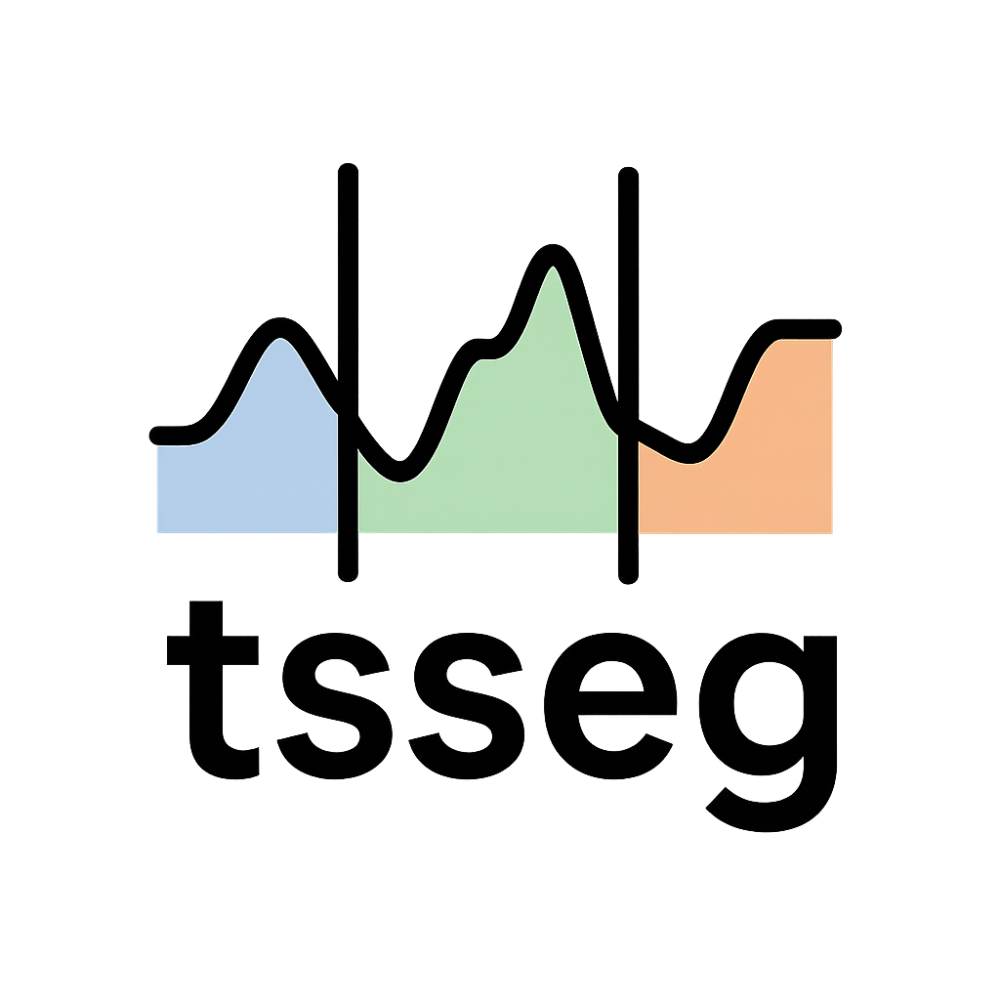

tsseg — Time Series Segmentation
================================

|

**tsseg** is a Python library for **Time Series Segmentation**, covering both
**Change Point Detection** and **State Detection**. It bundles 30+ segmentation
algorithms, evaluation metrics, data loaders and real-world benchmark datasets
under a unified API.

Segmentation algorithms share the same base class interface as the
`aeon <https://github.com/aeon-toolkit/aeon>`_ time-series toolkit, making them
interoperable with the broader aeon ecosystem. Several aeon segmenters are also
re-exposed through ``tsseg`` for convenience.

.. toctree::
   :hidden:
   :caption: User guide
   :maxdepth: 1

   guides/getting-started
   datasets
   detectors/index
   evaluation

Overview
--------

The library is organised around three concepts:

* :doc:`datasets` — loaders for the bundled and external benchmark datasets.
* :doc:`detectors/index` — 30+ change-point and state-detection algorithms
  exposed through a single ``fit`` / ``predict`` / ``fit_predict`` API.
* :doc:`evaluation` — evaluation metrics for both change-point and
  state-labelling tasks.

An interactive demo is available on
`Hugging Face Spaces <https://huggingface.co/spaces/fchavelli/tsseg>`_.

Installation
------------

From PyPI:

.. code-block:: bash

   pip install tsseg

With optional extras:

.. code-block:: bash

   pip install tsseg[torch]   # PyTorch-based detectors
   pip install tsseg[all]     # everything

From source (requires ``conda``):

.. code-block:: bash

   git clone https://github.com/fchavelli/tsseg.git
   cd tsseg
   make install
   conda activate tsseg-env

Most detectors work out of the box. Heavier dependencies are opt-in:

.. list-table::
   :header-rows: 1
   :widths: 25 75

   * - Extra
     - What it adds
   * - ``tsseg[aeon]``
     - Compatibility helpers for the aeon ecosystem
   * - ``tsseg[prophet]``
     - Facebook Prophet (``ProphetDetector``)
   * - ``tsseg[patss]``
     - Bayesian HSMM dependencies (``PatssDetector``)
   * - ``tsseg[torch]``
     - PyTorch-based detectors (``TireDetector``, ``Time2StateDetector``)
   * - ``tsseg[tglad]``
     - PyTorch + NetworkX (``TGLADDetector``)
   * - ``tsseg[tscp2]``
     - TensorFlow + TCN layer (``TSCP2Detector``)
   * - ``tsseg[accelerators]``
     - Numba / Cython speedups
   * - ``tsseg[docs]``
     - Sphinx documentation toolchain
   * - ``tsseg[all]``
     - Everything above

Usage
-----

.. code-block:: python

   from tsseg.data.datasets import load_mocap
   from tsseg.algorithms import ClapDetector
   from tsseg.metrics import StateMatchingScore

   # Load a time series
   X, y_true = load_mocap(trial=0)

   # Segment
   segmenter = ClapDetector()
   segmenter.fit(X)
   y_pred = segmenter.predict(X)

   # Evaluate
   score = StateMatchingScore().compute(y_true, y_pred)
   print(f"SMS: {score['score']:.4f}")

See :doc:`guides/getting-started` for a longer walk-through.

License
-------

``tsseg`` is released under the
`AGPLv3 <https://github.com/fchavelli/tsseg/blob/main/LICENSE>`_.

Several detectors bundle adapted or vendored code under their own licenses
(BSD, MIT, Apache-2.0, GPLv3, etc.). Each vendored directory contains a
``LICENSE`` file with the full terms.

Citation
--------

If you use ``tsseg`` in academic work, please cite:

.. code-block:: bibtex

@inproceedings{chavelli:hal-05654218,
  TITLE = {{tsseg: An Interactive Toolkit for Time Series Segmentation}},
  AUTHOR = {Chavelli, F{\'e}lix and Ermshaus, Arik and Yang, Fan and Sch{\"a}fer, Patrick and Paparrizos, John and Boniol, Paul},
  URL = {https://inria.hal.science/hal-05654218},
  BOOKTITLE = {{ECML-PKDD 2026 - European Conference on Machine Learning and Principles and Practice of Knowledge Discovery in Databases}},
  ADDRESS = {Naples, Italy},
  YEAR = {2026},
  MONTH = Sep
}

.. note::

   A reference publication is in preparation; the BibTeX entry above is a
   placeholder and will be updated when the paper is available.

Contributors
------------

* Felix Chavelli (Inria, ENS, Paris)
* Arik Ermshaus (Humboldt-Universität, Berlin)
* Fan Yang (The Ohio State University, Columbus)
* Paul Boniol (Inria, ENS, Paris)
* Patrick Schäfer (Humboldt-Universität, Berlin)
* John Paparrizos (The Ohio State University, AUTh, Columbus)

Contributions are welcome — see :doc:`guides/contributing` for development
setup, code style and testing guidelines.

Indices
-------

* :ref:`genindex`
* :ref:`modindex`
* :ref:`search`
